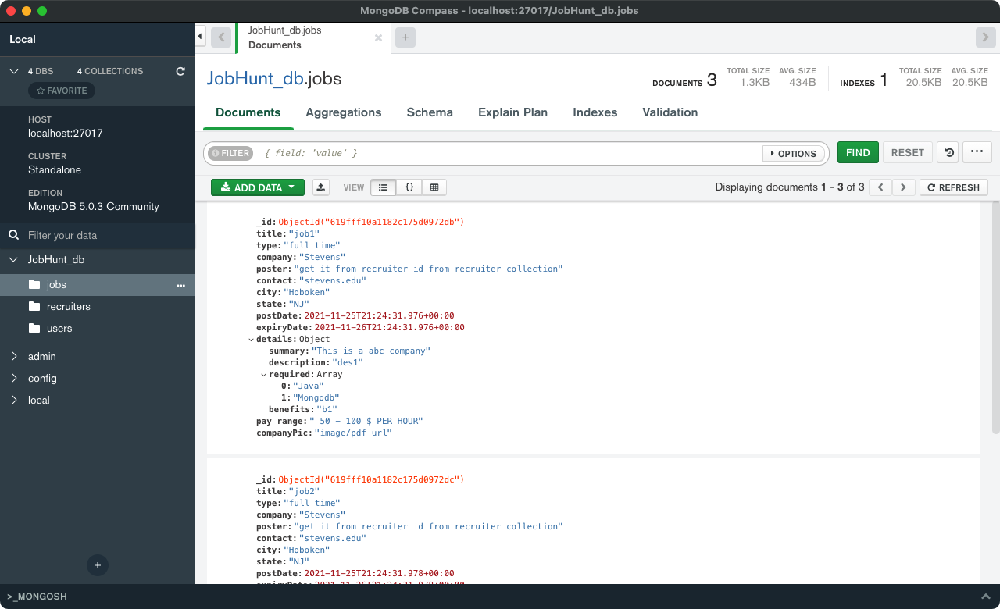
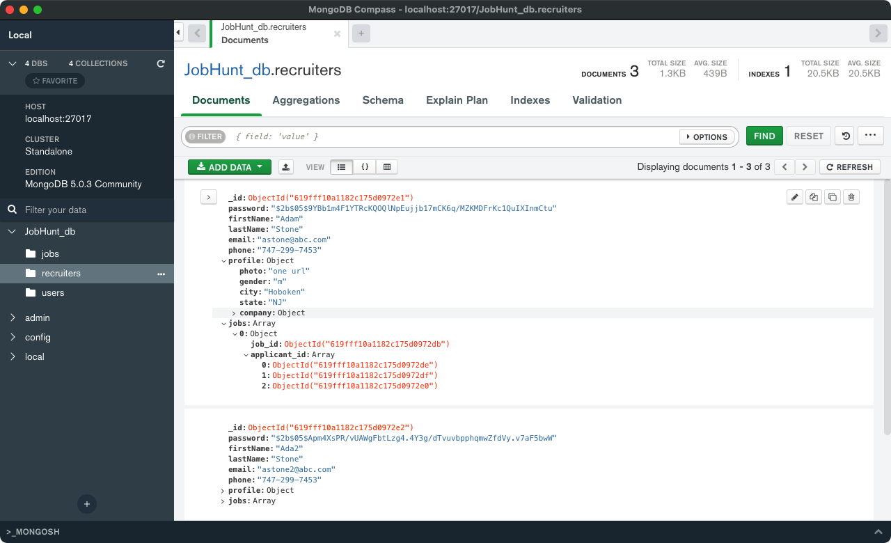

# Seed file

## Start

Under `task` folder, you can run the following to seed your database.

```node
node seed.js
```

**Note that every time you run it, it will drop your current database and seed a new one.** You can change it by commenting line 15 - 20 out.

## basic setup

- 3 users, 3 recruiters, 3 jobs
- For simplicity, users and recruiters have the same password. That is
  - `12345678` for user1 and recruiter1
  - `87654321` for user2 and recruiter2
  - `135792468` for user3 and recruiter3
- Users basic setup is in users.js, for simplicity, one user only have one profile
- Recruiters basic stepup is in recruiters.js
- Jobs basic setup is ni jobs.js

## Structure of database

- Status of all user's applied jobs are all `pending`
- User1 apply for all 3 jobs
- User2 apply for job1 and job2
- User3 apply for job1 and job3
- User1 saves job1, user2 saves job2 and job3, user3 saves all jobs.
- Each recruiter post 1 job, that is
  - recruiter1 post job1
  - recruiter2 post job2
  - recruiter3 post job3

## Sample pictures






